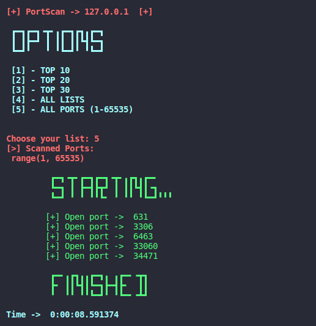

<h1 align="center">Portscan</h1>

* Tool for scanning ports, in python

<h1 align="center">
    
</h1> 

* The tool allows you to do a port scanning, choosing the top ports option, which can be 10, 20 and 30, or join all top ports in a single scan, or scan the range 1-65535, at the end being able to monitor the time that the scan took a while

<h1 align="center">
    
</h1> 